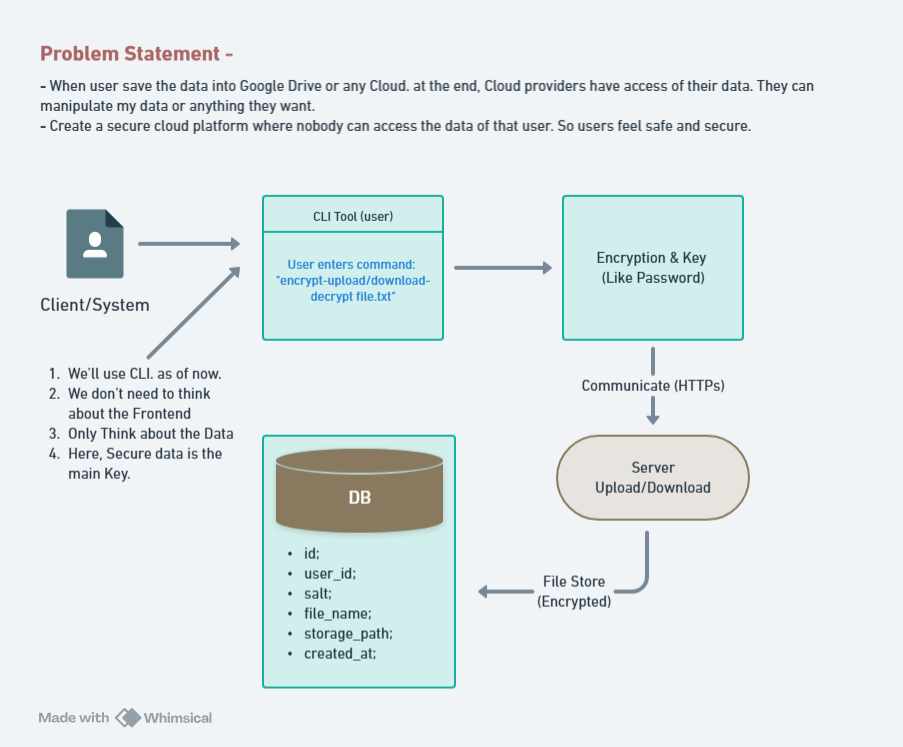

# Secure Cloud - CLI

Secure Cloud is a command-line tool that allows users to securely store files on a cloud server using client-side encryption. Even the service provider cannot access user data, ensuring complete privacy.

## Features

- **Zero-Knowledge Encryption**: Data is encrypted locally before uploading.
- **AES-256-GCM Encryption**: Ensures secure file encryption.
- **Salt & Nonce Mechanism**: Prevents brute-force attacks.
- **No Key Storage on Server**: The encryption key is never stored on the server.
- **Metadata & File Separation**: Prevents unauthorized access.

## Architecture

```
Client (CLI Tool)
  |
  |-- Encrypts File (AES-256-GCM)
  |-- Derives Key (PBKDF2/Argon2 + Salt)
  |-- Generates Nonce
  |
  |-- Uploads Encrypted File to Server (HTTPS)
  |-- Stores Metadata (Salt, Nonce, Path) in DB
  |
Server (File Storage + Metadata DB)
  |
  |-- Stores Encrypted File (File System)
  |-- Stores Metadata (PostgreSQL/SQLite)
```

<br>



## Installation

```sh
git clone https://github.com/abhishekkushwahaa/secure-cloud-cli.git
cd secure-cloud-cli
go run .
```

## Usage

### Commands

- `go run . help` : Displays help information for the Secure Cloud CLI.
- `go run . register` : Registers a new user with the Secure Cloud server.
- `go run . login` : Logs in a user to the Secure Cloud server.
- `go run . upload <file>` : Encrypts and uploads a file to the Secure Cloud server.
- `go run . download <file.enc>` : Downloads and decrypts a file from the Secure Cloud server.

### Encrypt and Upload a File

```sh
go run . upload file.txt
```

### Download and Decrypt a File

```sh
go run . download file.txt.enc
```

## Configuration

- **Storage Path:** `/data/encrypted_files/`
- **Database:** PostgreSQL/SQLite stores metadata (user_id, salt, nonce, filename, timestamp).

## Security Model

- The **encryption key is derived on the client** and never sent to the server.
- The **server only stores encrypted files** and metadata (salt, nonce, path).
- Only users with the correct password can decrypt their files.
